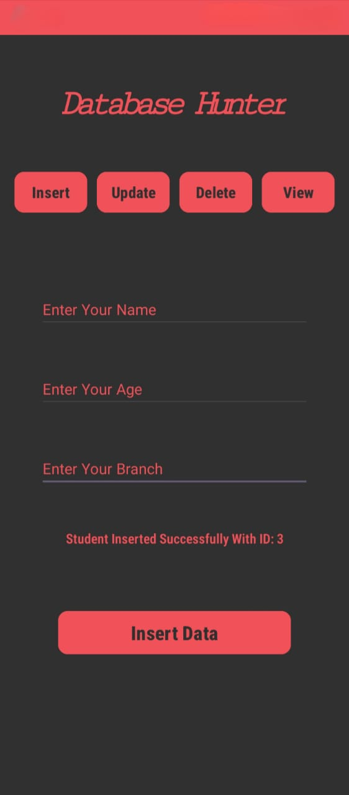
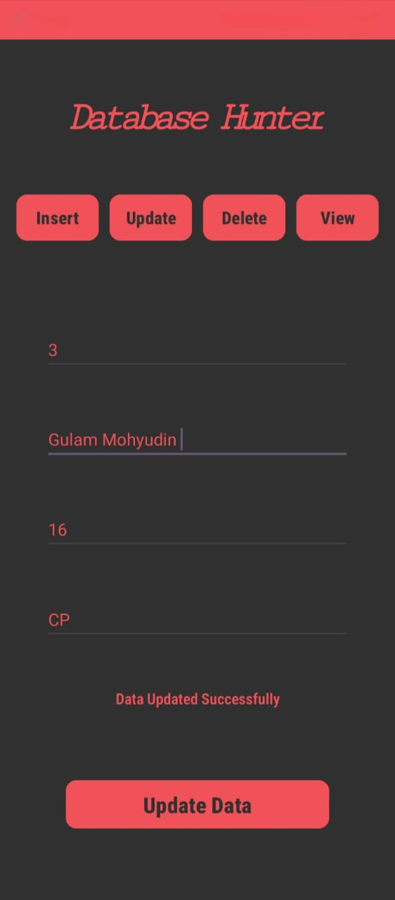
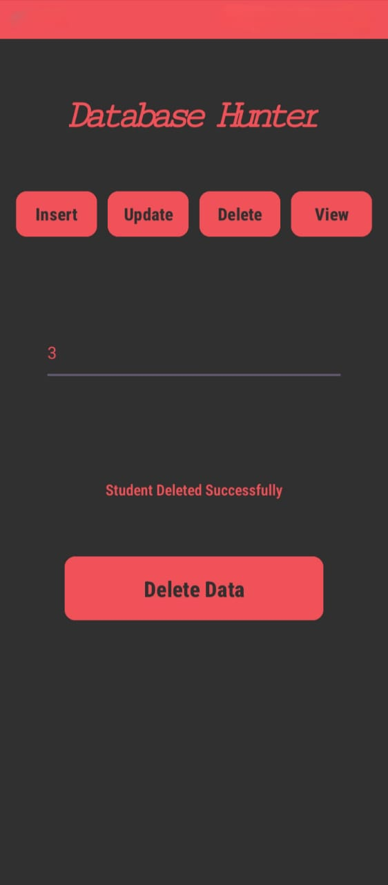
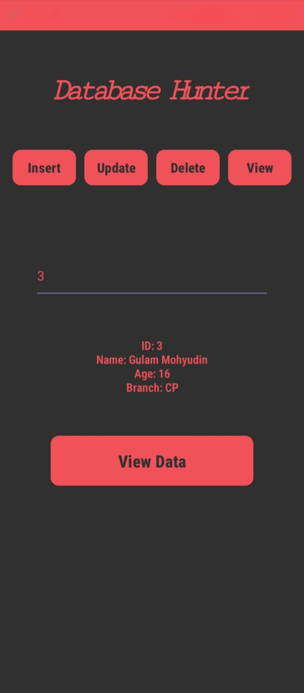

# 📱 Database Hunter  

Database Hunter is an Android application developed in **Kotlin** that allows users to perform complete **CRUD operations** (Create, Read, Update, Delete) using **SQLite Database**.  
It has a **stylish user interface**, a **custom logo**, and a **unique app name**, making it both functional and professional.  

---

## 🚀 Features  
- ✅ Add new records (Create)  
- ✅ View stored records (Read)  
- ✅ Update existing entries (Update)  
- ✅ Delete records (Delete)  
- ✅ Data persistence using SQLiteOpenHelper  
- ✅ Stylish UI with custom branding  

---

## 🛠️ Tech Stack  
- **Language:** Kotlin  
- **IDE:** Android Studio  
- **Database:** SQLite  
- **UI:** XML Layouts (ConstraintLayout, LinearLayout)  
- **Components:** EditText, Button, RecyclerView/ListView, TextView  

---

## 📷 Screenshots  
|Logo | Home Screen | Insert | Update | Delete | View |
|-----|-------------|--------|--------|--------|------|
| |  |  |  |  |  |

---

## 📂 Project Structure  
- `MainActivity.kt` – Handles UI logic and database operations  
- `DatabaseHelper.kt` – Manages SQLite database, table creation, and CRUD queries  
- `activity_main.xml` – UI layout with input fields and buttons  
- `colors.xml`, `themes.xml` – Defines styles and themes  
- `AndroidManifest.xml` – Contains app name and logo configuration  

---

## 🎯 Learning Outcomes  
- Hands-on experience with **SQLite Database in Android**  
- CRUD operations with **Kotlin + SQL queries**  
- Integration of **UI design with backend logic**  
- Branding with **custom logo & app name**  

---

## 📌 Future Enhancements  
- Add search functionality  
- Implement data export/import  
- Add authentication system  
- Cloud integration (Firebase)  

---

### 💡 Author
Developed by **Gulam Mohyudin** 👨‍💻  
Feel free to connect with me on [LinkedIn](https://www.linkedin.com/in/gulammohyudin-memon/) or star ⭐ this repo if you liked it!  
